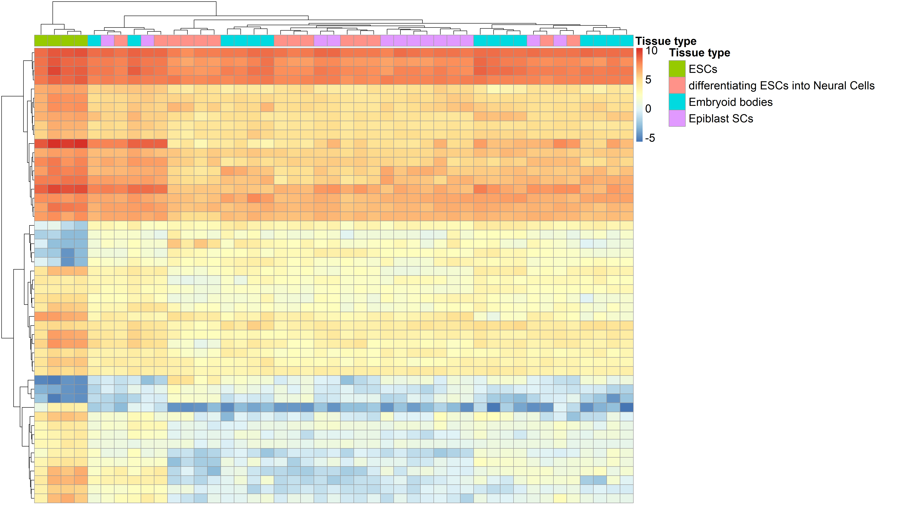

# Differential Expression Analysis of different tissue types in the development of the 129/ola mouse strain

## Project: SRP130963 - Early developmental tissues in 129/Ola mouse strain

### Tissue Descriptions

#### Embryonic Stem Cells (ESCs):
Pluripotent stem cells derived from the inner cell mass of a blastocyst. They possess the unique ability to self-renew indefinitely and can differentiate into all three germ layers: ectoderm, mesoderm, and endoderm.

#### Differentiating ESCs into Embryoid Bodies (EBs):
A method of spontaneous differentiation where ESCs are grown in non-adherent conditions to form three-dimensional aggregates. EBs mimic early embryonic development and contain a disorganized mix of cells from all three primary germ layers.

#### Differentiating ESCs into EpiSCs (Epiblast Stem Cells):
Represents a transition from a "naive" pluripotent state to a "primed" state. EpiSCs are derived from the post-implantation epiblast and exhibit different growth factor requirements and epigenetic landscapes compared to original ESCs.

#### Differentiating ESCs into Neural Cells:
A directed differentiation process that guides pluripotent cells toward a neuroectodermal lineage. This typically involves inhibiting BMP signaling to produce neural progenitors, neurons, astrocytes, and oligodendrocytes for disease modeling or regenerative research.

### Why these tissues?

These four tissue types represent a gradient of early embryonic differentiation starting from the fully pluripotent state (ESCs) and moving toward three distinct early developmental paths. Comparing their transcriptomes allows us to observe how gene expression changes during the earliest stages of cell fate commitment, and to identify genes whose expression marks the transition from pluripotency to lineage
specification. 

### Dataset: SRP130963

The study SRP130963, available through the recount3 repository, was used as the source of RNA-seq data. It contains 45 samples from wild-type mice of the 129/Ola strain. The samples are distributed across the four tissue types described above: 4 ESC samples, 14 Embryoid Body samples, 13 Epiblast Stem Cell samples, and 14 Neural Cell differentiation samples. Since all samples share the same genotype and genetic background, confounding variables related to strain or genotype differences are minimized.

### Tools and Workflow Summary

1. Data retrieval: The recount3 R package was used to download the RNA-seq data from SRP130963 and build a RangedSummarizedExperiment (RSE) object containing raw coverage counts for 55,421 genes across 45 samples. Read counts were computed with compute_read_counts() and SRA attributes were expanded for metadata access.

2. Quality control and filtering: A gene-level proportion score (assigned reads / total reads) was calculated per sample to assess sequencing quality. The edgeR function filterByExpr() was applied to remove lowly expressed genes, retaining 22,257 genes. Library size normalization was performed with calcNormFactors().

3. Linear model design: A model matrix was built using tissue type as the main variable and the assigned gene proportion as a covariate. The limma-voom pipeline (voom + lmFit) transformed the count data to log-CPM values with precision weights suitable for linear modeling.

4. Variance partition: The variancePartition package was used to quantify how much of the total gene expression variance is explained by tissue type versus residual (unexplained) factors.

5. Differential expression: Empirical Bayes moderation (eBayes) was applied to obtain moderated t-statistics, log fold-changes, and adjusted p-values for each gene across tissue comparisons.

6. Visualization: Four types of plots were generated using ggplot2, pheatmap, ggrepel, patchwork, and limma's plotMDS to summarize the results of the differential expression analysis.

## PLOT BIO-INTERPRETATIONS

### 1. Average Expression Plot (MA Plot)

#### How to read it:
The plot displays the relationship between the average expression level of each gene (x-axis) and its log fold-change between conditions (y-axis). Genes are colored based on their statistical significance and direction of change: red points represent upregulated genes (adjusted p-value < 0.05 and logFC > 1) while blue points represent
downregulated genes (adjusted p-value < 0.05 and logFC < -1). Grey points correspond to genes that did not reach statistical significance or did not pass the fold-change threshold. The dashed horizontal lines mark the logFC cutoffs at -1 and 1.

#### Interpretation of the project data:
The plot reveals that the majority of genes cluster around zero fold-change, indicating that most genes do not show strong differential expression between the tissue types. However, a subset of genes is clearly separated above and below the fold-change thresholds. The upregulated genes (red) and downregulated genes (blue) are spread across a wide range of average expression levels, suggesting that
differentially expressed genes are not restricted to either highly or lowly expressed transcripts. This pattern is consistent with the biological expectation that early differentiation involves changes in genes of diverse functional categories and expression levels.

### 2. Volcano Plots

#### How to read it:
A volcano plot is a standard visualization for differential expression results. It plots the log2 fold-change (x-axis) against the negative log10 of the p-value (y-axis), so genes that are both highly changed and statistically significant appear in the upper-left or upper-right corners. Dashed vertical lines mark the logFC cutoffs at -1 and 1, and a dashed horizontal line marks the p-value threshold of 0.05.
Significant genes are colored using a gradient that reflects theadjusted p-value: warmer colors (red) indicate lower (more significant) p-values, while cooler colors (blue) indicate p-values closer to the 0.05 cutoff. Non-significant genes appear in light grey. Three volcano plots are presented, each comparing ESCs against one of the other tissue types, and the top 4 genes with the lowest p-values are labeled in each panel.

#### Interpretation of our data:
Across the three comparisons (ESCs vs Neural Cells, ESCs vs Embryoid Bodies, and ESCs vs Epiblast Stem Cells), several genes consistently appear among the most significant hits. Among the genes with the lowest p-values across comparisons we find:

- Socs3 (Suppressor of Cytokine Signaling 3): This gene is a key negative regulator of the JAK-STAT signaling pathway. SOCS3 modulates LIF receptor signaling, which is essential for maintaining pluripotency. Studies have shown that overexpression of SOCS3 promotes ESC differentiation toward hematopoietic progenitors rather than self-renewal. Its strong differential expression here is consistent with its role as a molecular switch between the pluripotent and differentiated states.

- Hk1 (Hexokinase 1): Hexokinase 1 catalyzes the first step of glycolysis, the phosphorylation of glucose. During early embryonic development, metabolic reprogramming is a hallmark of the transition from pluripotency to differentiation: stem cells rely heavily on glycolysis and shift their metabolic profile as they differentiate. The expression pattern of Hk1 in the early mouse embryo suggests a regulatory role for this enzyme during this critical developmental window.

- Ephx1 (Epoxide Hydrolase 1): EPHX1 is a biotransformation enzyme that converts reactive epoxide intermediates into less toxic diols. It has been shown to protect early embryos from oxidative stress in the oviductal environment, and its expression changes during differentiation suggest it plays a protective role as cells become more metabolically active during lineage commitment.

- Hap1 (Huntingtin-Associated Protein 1): HAP1 is a neuronal protein involved in intracellular trafficking along microtubules. In mouse development, Hap1 transcripts are first detected at embryonic day 8.5 in the neuroepithelium. Its appearance among the most differentially expressed genes, particularly in the neural comparison, is coherent with its known role in early nervous system development and neuronal differentiation.

These genes are strong candidates as markers of early development because they participate directly in the regulatory, metabolic, and protective mechanisms that cells engage when transitioning from pluripotency to lineage-specific fates.

### 3. Heatmap

#### How to read it:
A heatmap represents expression levels of genes (rows) across samples (columns) using a color scale where red tones indicate higher expression and blue tones indicate lower expression. Both rows and columns are hierarchically clustered so that genes with similar expression profiles are grouped together, and samples with similar overall patterns are placed side by side. An annotation bar at the top of the heatmap indicates the tissue type of each sample.

#### Interpretation of our data:
The heatmap displays the top 50 most differentially expressed genes across all 45 samples. The clustering of samples shows a partial grouping by tissue type: ESC samples tend to cluster together and show a distinct expression pattern compared to the differentiating tissues. Among the differentiating tissues, blocks of co-regulated genes are visible, with some genes being strongly activated in one lineage but not in others. However, the boundaries between tissues are not entirely sharp, reflecting the fact that these cells are at very early stages of differentiation and still share a substantial portion of their transcriptional program. The heatmap confirms that there are clear gene expression signatures distinguishing ESCs from their differentiated derivatives, while also illustrating the transcriptional overlap inherent to closely related developmental stages.

### 4. MDS Plot (Multidimensional Scaling)

#### What it shows:
An MDS plot reduces the high-dimensional gene expression data into two dimensions, positioning samples so that the distances between them approximate the overall differences in their expression profiles. Samples with similar transcriptomes appear close together, while those with distinct profiles are placed further apart. Each sample is labeled and colored by its tissue type.

#### Interpretation of our data:
The MDS plot does not show a very clear separation between the four tissue types. Instead, the samples from different tissues appear partially mixed and do not form well-defined, distinct clusters. This result is not unexpected given the biological context of the experiment: all four tissue types correspond to very early stages of
embryonic development. ESCs are fully pluripotent, and the three differentiating populations (Embryoid Bodies, Epiblast Stem Cells, and Neural Cells) are still in the initial phases of lineage commitment. Because these tissues have not yet diverged into fully distinct cell identities, their overall transcriptomes remain relatively similar, which is reflected in the overlapping distribution on the MDS plot. This observation is consistent with the variance partition analysis described below.

## NOTE ON VARIANCE EXPLAINED BY TISSUE TYPE

A relevant finding throughout this analysis is that the tissue type variable explains only approximately 25% of the total variance in gene expression. This was quantified using the variancePartition package and was also visually apparent in the MDS plot, where samples from different tissues did not form clearly separated groups. The
possibility of batch effects was considered, but no variables in the metadata indicated the presence of technical batches that could account for the remaining unexplained variance. Therefore, the low proportion of variance attributed to tissue is not an indication of poor data quality or analytical error. Rather, it reflects the
intrinsic biology of the system: these four conditions represent a continuum of very early developmental states. Three of them are actively transitioning from pluripotency and one remains in a fully pluripotent state, so the transcriptional differences among them are real but modest. The 25% of variance explained by tissue is sufficient to identify over 3,000 differentially expressed genes at an adjusted p-value threshold of 0.05, confirming that meaningful biological signal exists despite the overall transcriptomic similarity between these early developmental tissues.